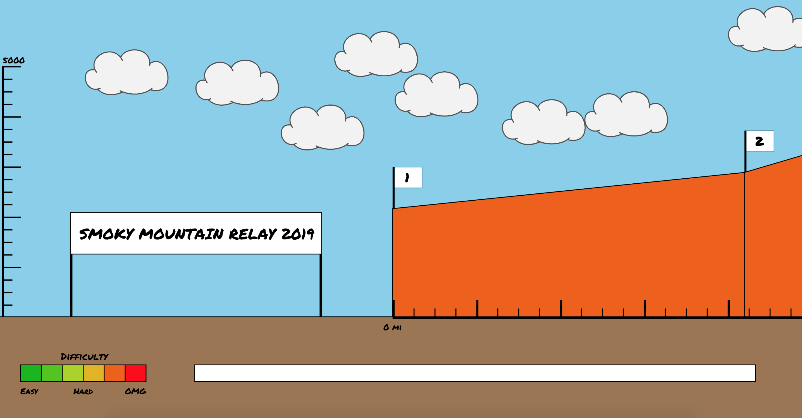
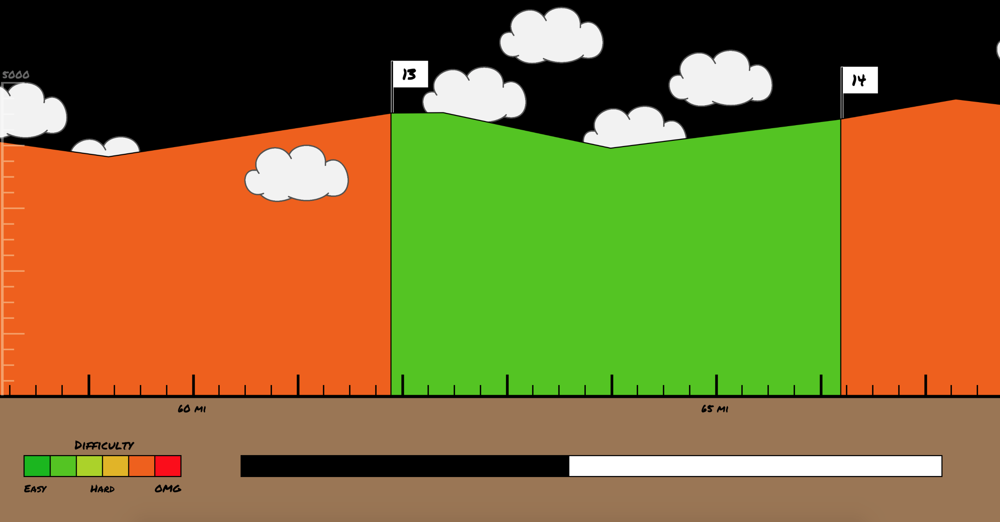
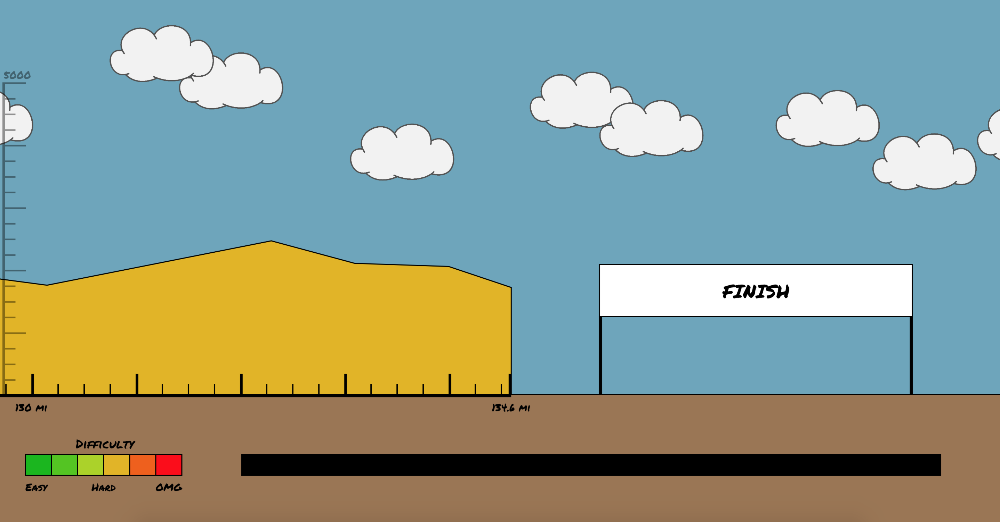

# smr-legs
At the end of April, I will be running the Smoky Mountain Relay with seven other members of Duke Club Running. This 140-mile relay race is comprised of 24 legs that wind throughout Pisgah National Forest. While there are lists of the leg distances, elevation changes, and relative difficulties, I found it hard to wrap my head around the progression of the race and how the legs truly compared to one another. So, I sought to create a playful, yet useful visualization of the race that allows the user to virtually "run" the race. Hopefully this would help the user better understand the difference in difficulty between legs and overall portions of the race, thus allowing for a more informed division of legs between team members. I also hoped to convey just how much of the race takes place during the night.

Using the provided distance, start elevation, end elevation, and diffiulty measurements provided on the race website, I created a JSON file containing data for all of the legs. Using small graphs provided with the map for each leg, I also estimated the position and elevation of peaks and valleys, thus allowing me to more accurately portray the terrain. These legs are drawn side-by-side, scaled down to fit on the screen. The vertical axis on the left of the screen is dynamically created to fit the range of elavations provided by the JSON file. The horizontal axis on the bottom is similarly created according to the total distance of the race. Therefore, the legs can be updated for future years without requiring new code. The difficulty gauge in the bottom left and the colors used to portray each leg's difficulty is also created dynamically based on the range of difficulties.

The user can either use the left and right arrow keys or scroll up and down to traverse through the visualization. As the user progresses along the race, the sky progressively darkens until it is black, remaining so for the approximate portion of the race taking place at night. As the user approaches the end, the sky brightens once again with the rising of the sun. There is also a progress bar at the bottom of the screen to provide positional context within the scope of the entire race.

